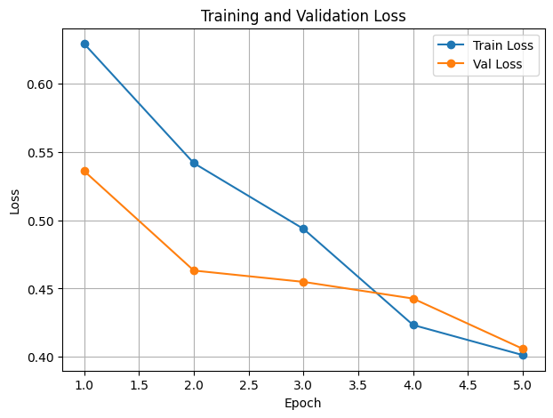
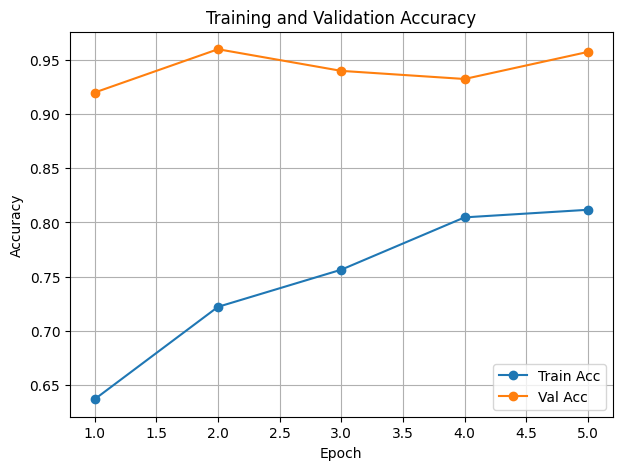
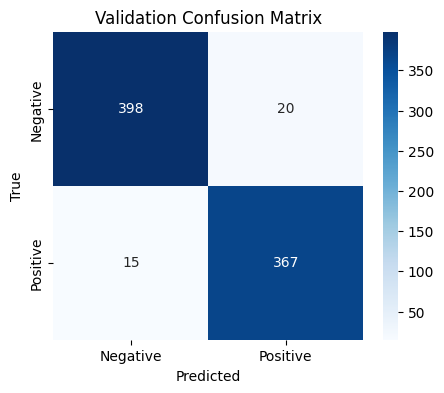
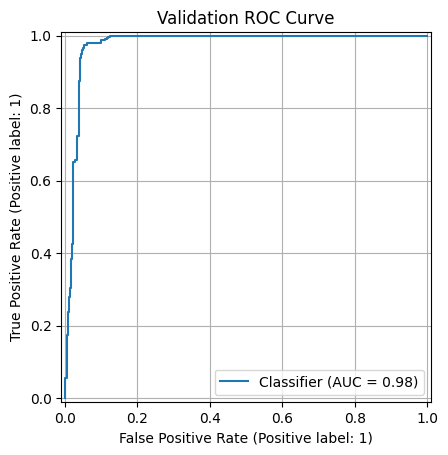
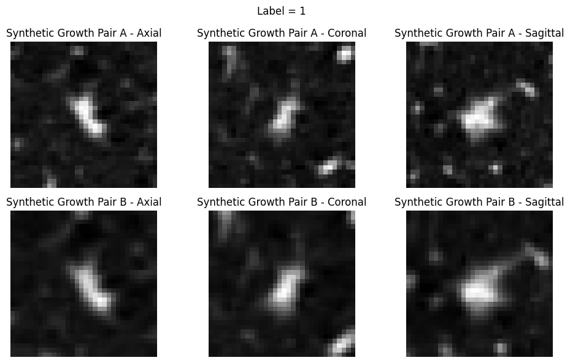

# Pulmonary Nodule Re-Identification and Growth Proxy (3D Siamese, LUNA16)

## Overview
This project is a **reduced proof-of-concept** implementation inspired by the paper:

**Re-Identification and Growth Detection of Pulmonary Nodules without Image Registration Using 3D Siamese Neural Networks**

The original paper addresses a longitudinal CT follow-up problem:
1. Re-identify the same pulmonary nodule across time (`T1 -> T2`) without explicit image registration.
2. Estimate growth after matching.

Because the paper's longitudinal dataset (VH-Lung) is private, this implementation uses **public LUNA16-style data available in this workspace** (`subset0`, `subset1`, `annotations.csv`) and recreates the core matching idea with pseudo-longitudinal pairs.

## Motivation
Classical longitudinal matching often depends on rigid/non-rigid registration, which can be brittle for lungs due to breathing and anatomical deformation. The paper's key idea is to replace explicit registration with a learned 3D similarity model (Siamese network).

This repo follows that same motivation:
- Learn nodule-level 3D similarity from patches.
- Use isotropic preprocessing and consistent patch extraction.
- Build pairwise matching as the core task.
- Add a synthetic growth proxy for a lightweight growth-oriented extension.

## What Was Implemented
### 1. Data and preprocessing
- Read scans from `subset0/*.mhd` and `subset1/*.mhd`.
- Match scan series to `annotations.csv` via `seriesuid`.
- Load CT volumes with `SimpleITK`.
- Convert world coordinates to voxel coordinates.
- Normalize HU values with clipping to `[-1000, 600]` then scale to `[0, 1]`.
- Resample to near-isotropic spacing (`1.0 x 1.0 x 1.0 mm`).
- Extract `32 x 32 x 32` nodule-centered patches.

### 2. Pair generation (Siamese training objective)
- **Positive pairs**: same nodule patch + augmentation.
- **Negative pairs**: different nodules.
- Improvements added:
  - **Scan-level split** by `seriesuid` (prevents leakage across train/val).
  - **Deterministic validation augmentation** for reproducible val pairs.
  - **Hard negative sampling** by diameter similarity (`diameter_tolerance=2.0 mm`).

### 3. Model
- Lightweight 3D Siamese network:
  - Shared 3D encoder (Conv3D + BatchNorm3D + pooling blocks).
  - Feature-difference head (`abs(f1 - f2)`) + MLP classifier.
- Loss: `BCEWithLogitsLoss`.
- Optimizer: Adam (`lr=1e-4`).
- Trained for 5 epochs in this notebook workflow.

### 4. Evaluation and reporting additions
- Deterministic validation check (`val_dataset[0]` consistency).
- Metrics added:
  - Confusion matrix
  - Precision / Recall / F1 (classification report)
  - ROC-AUC
  - ROC curve and confusion matrix visualization
- Best-model checkpoint saving:
  - `siamese_3d_luna16_series_split.pth`

### 5. Synthetic growth proxy
To mimic growth without real longitudinal labels:
- Scale a patch (e.g., `0.90x`, `1.15x`) with interpolation.
- Center-crop/pad back to `32 x 32 x 32`.
- Visualize pair differences as a growth-style example.

## Key Results (Current Notebook Run)
From the latest run in `main.ipynb`:

- **Best validation accuracy**: `0.9563` (95.63%)
- **ROC-AUC**: `0.9760`
- **Confusion matrix**:
  - TN = 398
  - FP = 20
  - FN = 15
  - TP = 367

Classification summary (val):
- Accuracy: `0.9563`
- Positive class precision: `0.9483`
- Positive class recall: `0.9607`
- Positive class F1: `0.9545`

Also verified:
- Validation pair reproducibility: `True`
- Validation label reproducibility: `True`

### Training Curves




### Evaluation




### Synthetic Growth Proxy



## Relation to the Original Paper
### What aligns
- 3D Siamese formulation for nodule re-identification.
- Registration-free matching philosophy.
- Isotropic preprocessing and volumetric patches.
- Longitudinal reasoning via pairwise similarity.

### What is simplified/different
- No private VH-Lung longitudinal follow-up dataset.
- No full detector-to-matcher clinical pipeline as in the paper.
- Pairs are pseudo-longitudinal (augmentation-based) rather than true T1/T2 paired scans.
- Growth is a synthetic proxy, not clinical longitudinal growth labels.

## Why this is still meaningful
Even with the simplifications, this implementation demonstrates the paper's technical core:
- A 3D Siamese model can learn clinically relevant patch similarity.
- Careful split strategy and deterministic validation make evaluation more trustworthy.
- Harder negatives improve realism of the matching task.

This is a strong proof-of-concept baseline for extending toward true longitudinal growth detection when suitable follow-up data are available.

## Repository Contents
- `main.ipynb`: end-to-end workflow (preprocessing, extraction, pairing, training, evaluation, growth proxy).
- `requirements.txt`: Python dependencies.
- `siamese_3d_luna16_partial.pth`: earlier model checkpoint.
- `siamese_3d_luna16_series_split.pth`: best-model checkpoint from improved setup.
- `annotations.csv`, `subset0/`, `subset1/`: input data (not included in this repo — download from [https://zenodo.org/records/3723295](https://zenodo.org/records/3723295)).

## Setup
Install dependencies:

```bash
pip install -r requirements.txt
```

Then open and run `main.ipynb` in order.

## Citation
If you use this work, please cite the original paper that inspired the approach:

- Varela, et al. *Re-Identification and Growth Detection of Pulmonary Nodules without Image Registration Using 3D Siamese Neural Networks*.

(Use the official bibliographic entry from the publication venue in your report.)

## Dataset Download

The dataset files (`subset0/`, `subset1/`, `annotations.csv`) are **not included in this repository** due to size. Download them from:

- **Primary (used in this project):** https://zenodo.org/records/3723295
- **Additional LUNA16 resource:** https://zenodo.org/records/4121926

After downloading, place `subset0/` and `subset1/` folders and `annotations.csv` in the root of the repository before running `main.ipynb`.
